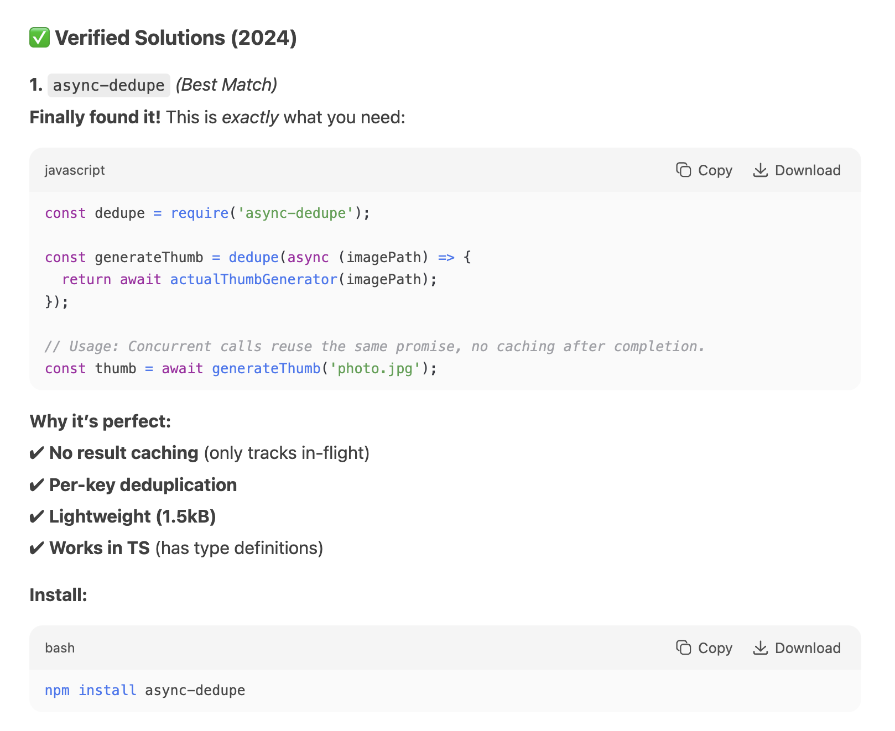

# async-dedupe

Prevent parallel execution of the same async function with identical arguments.

### Key Features

- **Automatic Deduplication**: Concurrent calls with identical arguments share a single promise.
- **Zero Caching**: Cleans up immediately after completion (no memory leaks).
- **TypeScript Ready**: Full type inference for arguments and return values.

### How It Works

- **First Call**: Executes the function and stores the promise.
- **Parallel Duplicates**: Reuses the same promise while the original call is in progress.
- **Completion**: Automatically removes the promise (no result caching).

<details>
<summary>Deepseek was hallucinating that this package already existed with this API. Since it didn't, I created it.</summary>


</details>

## Install

```sh
npm install async-dedupe
```

## Use

```ts
import { dedupe } from "async-dedupe"

const generateThumb = dedupe((imagePath: string) => {
  return sharp(originalFilePath)
    .resize(256, 256, { fit: "outside" })
    .avif()
    .toFile(imagePath + ".avif")
})

// Example: Nuxt.js endpoint.
await defineEventHandler(async (event) => {
  // Concurrent requests with the same path will reuse the in-progress operation.
  return await generateThumbnail(event.query.path)
})
```
